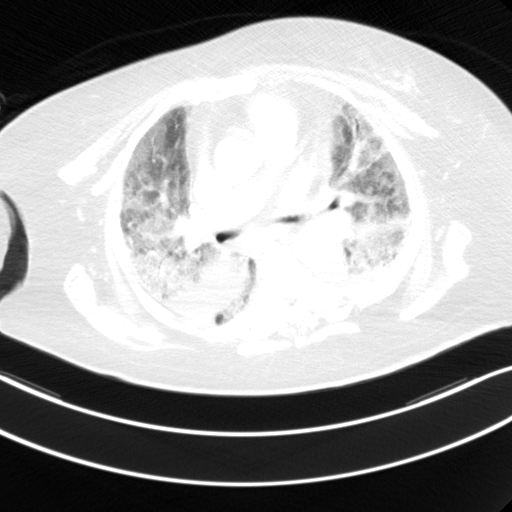
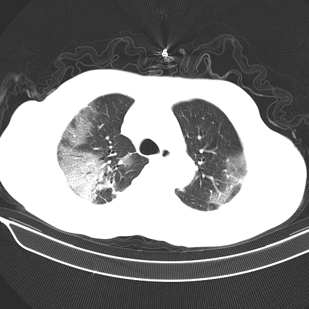
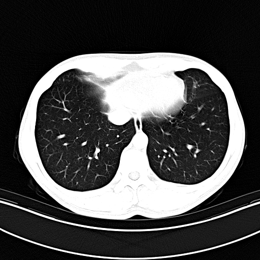
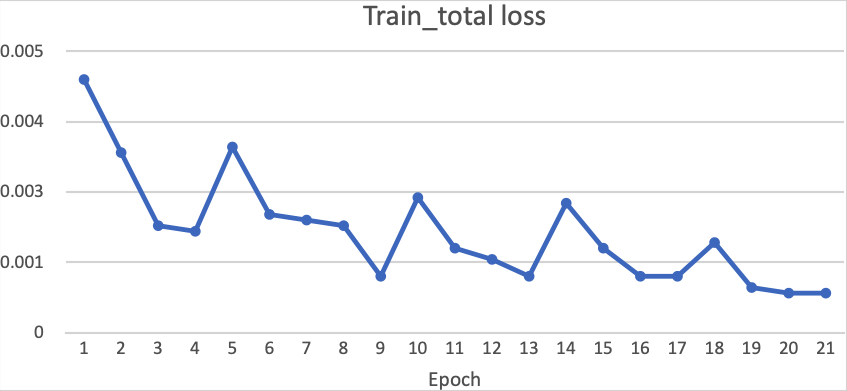
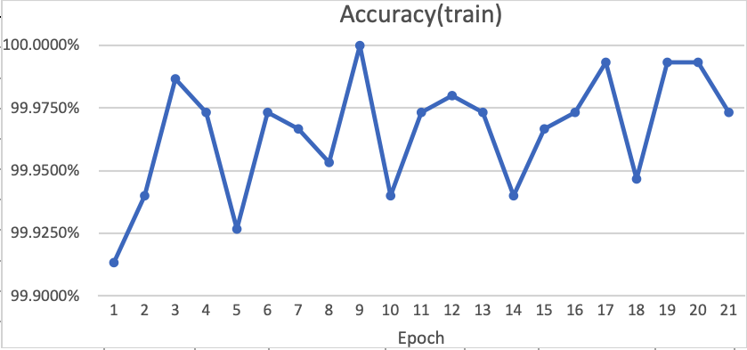
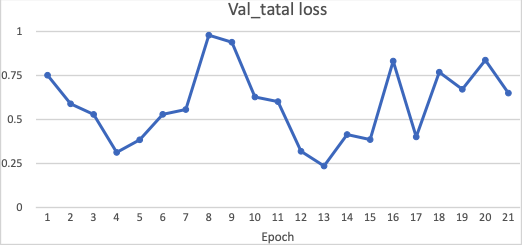
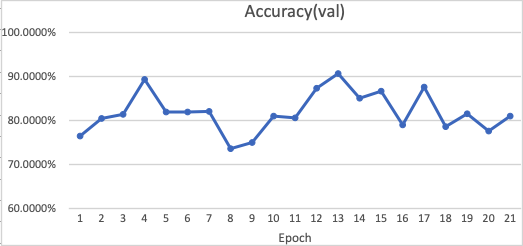
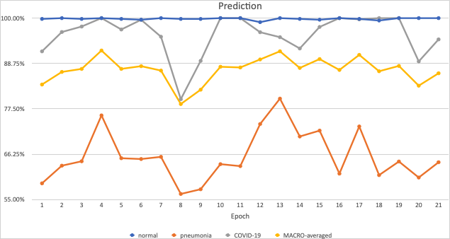

# CS539-COVID CT CLASSIFICATION

Github Link: https://colab.research.google.com/drive/1UxfVkl6cqcn0gnZqFF3gj36UOqfXXQCz#scrollTo=nPBxMYePSnX0

## Background & Motivation

Our project is to find a set of models and parameters that would give precise predictions about a patient’s health situation: whether he/she is healthy, has been infected by COVID-19 or has been experiencing normal pneumonia.

Our models could potentially help doctors diagnose COVID-19 patients given lung CT scans. Our models are also useful for distinguishing COVID patients from normal pneumonia patients.

## Data

The orginial dataset contains 75000 images. We trained on our dataset containing 15000 images.

There are 5000 images for each category: COVID, Pneumonia, Normal.

Here are three sample images from different categories:

  

  <em>COVID Lungs</em>

  

  <em>Pneumonia Lungs</em>

  

  <em>Normal Lungs</em>

## Network

We used 6 different models to train the dataset. The three main networks are VGG, ResNet and DenseNet.

## Very Deep Convolutional Network (VGG)

### VGG16

  

**VGG16** is a convolutional neural network model proposed by K. Simonyan and A. Zisserman from the University of Oxford in the paper “Very Deep Convolutional Networks for Large-Scale Image Recognition”. It was one of the famous model submitted to ILSVRC-2014. It makes the improvement over AlexNet by replacing large kernel-sized filters (11 and 5 in the first and second convolutional layer, respectively) with multiple 3×3 kernel-sized filters one after another.

### VGG19

**VGG19** is a convolutional neural network that is 19 layers deep.

  

## Deep Residual Neural Network (ResNet)

### ResNet101

A **residual neural network (ResNet)** is an artificial neural network (ANN) of a kind that builds on constructs known from pyramidal cells in the cerebral cortex. Residual neural networks do this by utilizing skip connections, or shortcuts to jump over some layers. Typical ResNet models are implemented with double- or triple- layer skips that contain nonlinearities (ReLU) and batch normalization in between.

  

### ResNet152

**ResNet152** has a depth of 152 layers.

  

## Densely Connected Convolutional Networks (DenseNet)

### DenseNet161

A **DenseNet** is a type of convolutional neural network that utilises dense connections between layers, through Dense Blocks, where we connect all layers (with matching feature-map sizes) directly with each other. To preserve the feed-forward nature, each layer obtains additional inputs from all preceding layers and passes on its own feature-maps to all subsequent layers.

  

### DenseNet201

**DenseNet201** has a depth of 201 layers

  

## Result

Training Loss : 0.0007

  

Training Accuracy : 99.9733%

  

Validation Loss : 0.6512

  

Validation Accuracy : 81.0667%

  

Prediction Rate by Categories

  

Confusion matrix, without normalization

  

MACRO-averaged: prediction= 86.32 %,recall= 81.07 %,f1= 83.61

## Team

Yan Zhang

Zeyu Hu

Chang Liu

Jiani Wang

Ziyang Xu

## References

https://www.nature.com/articles/s41598-021-93832-2

https://neurohive.io/en/popular-networks/vgg16/

https://en.wikipedia.org/wiki/Residual_neural_network

https://paperswithcode.com/method/densenet
